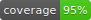

# coverage-badge

[](https://github.com/yonasBSD/coverage-badge/actions/workflows/coverage.yml)
[](https://crates.io/crates/coverage-badge)
[](https://opensource.org/licenses/MIT)


A GitHub Action and CLI tool that generates shields.io-style SVG badges for test coverage.

## Table of Contents

- [Quick Start](#quick-start)
- [Full Workflow Example](#full-workflow-example)
- [Action Inputs](#action-inputs)
- [CLI Usage](#cli-usage)
- [Color Thresholds](#color-thresholds)
- [License](#license)

## Quick Start

Add this step to your workflow after running your coverage tool:

```yaml
- name: Generate coverage badge
  uses: yonasBSD/coverage-badge@v1
  with:
    coverage: ${{ steps.coverage.outputs.percentage }}
    output: assets/coverage.svg
    commit: true
```

That's it! The action generates the badge and commits it to your repo. Then reference it in your README:

```markdown

```

## Full Workflow Example

<details>
<summary>Click to expand complete workflow</summary>

```yaml
name: Coverage

on:
  push:
    branches: [main]

permissions:
  contents: write

jobs:
  coverage:
    runs-on: ubuntu-latest
    steps:
      - uses: actions/checkout@v4

      # Replace with your actual coverage tool
      - name: Run tests with coverage
        id: coverage
        run: |
          # Example: extract coverage from your tool's output
          # For tarpaulin: jq '.coverage' tarpaulin-report.json
          # For pytest-cov: grep -oP 'TOTAL.*\s+\K\d+' coverage.txt
          echo "percentage=85.5" >> $GITHUB_OUTPUT

      - name: Generate coverage badge
        uses: yonasBSD/coverage-badge@v1
        with:
          coverage: ${{ steps.coverage.outputs.percentage }}
          output: assets/coverage.svg
          commit: true
          commit-message: 'chore: update coverage badge'
```

</details>

## Action Inputs

| Input | Required | Default | Description |
|-------|----------|---------|-------------|
| `coverage` | Yes | - | Coverage percentage (0-100, decimals allowed) |
| `output` | Yes | - | Output path for the SVG file |
| `commit` | No | `false` | Commit and push the badge |
| `commit-message` | No | `Update coverage badge` | Custom commit message |

## CLI Usage

For local development or custom setups, use the CLI directly.

**Install:**

```bash
# Via Cargo
cargo install coverage-badge

# Or download from Releases
# https://github.com/yonasBSD/coverage-badge/releases
```

**Run:**

```bash
coverage-badge -c 85 -o assets/coverage.svg
```

| Option | Short | Description |
|--------|-------|-------------|
| `--coverage` | `-c` | Coverage percentage (0-100, decimals allowed) |
| `--output` | `-o` | Output path for the SVG file |

## Color Thresholds

| Coverage | Color |
|----------|-------|
| < 50% | Red |
| 50-79% | Yellow |
| ≥ 80% | Green |

## License

MIT
